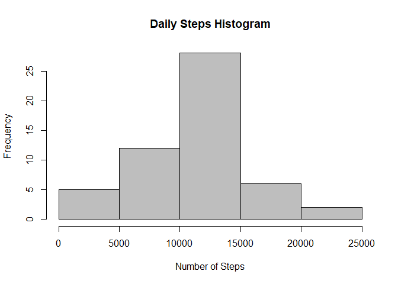
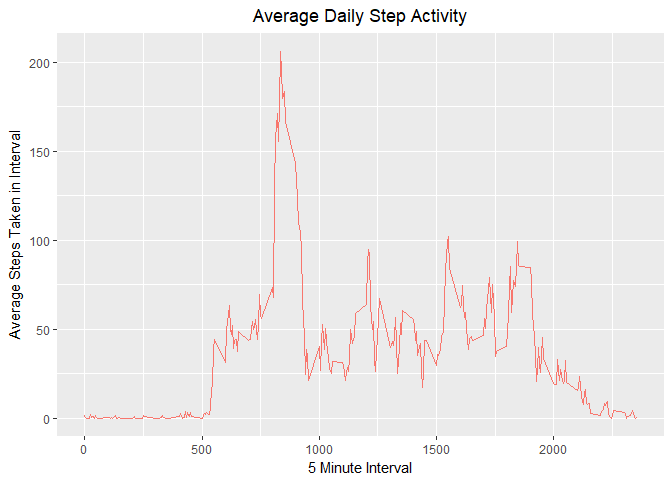
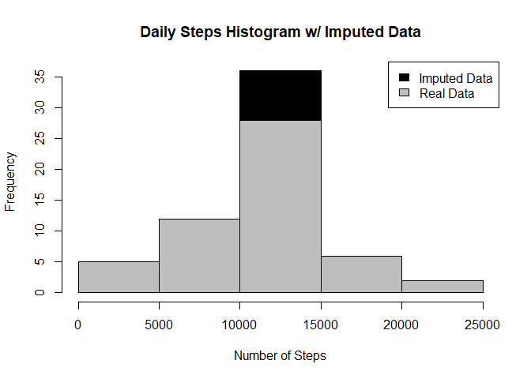
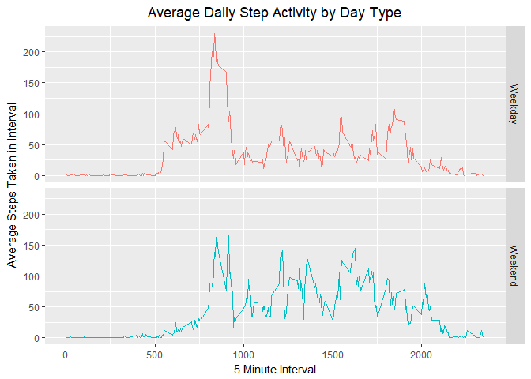

#### Roger Toussaint
## Introduction

It is now possible to collect a large amount of data about personal movement using activity monitoring devices such as a Fitbit, Nike Fuelband, or Jawbone Up. These type of devices are part of the "quantified self" movement - a group of enthusiasts who take measurements about themselves regularly to improve their health, to find patterns in their behavior, or because they are tech geeks. But these data remain under-utilized both because the raw data are hard to obtain and there is a lack of statistical methods and software for processing and interpreting the data.

This assignment makes use of data from a personal activity monitoring device. This device collects data at 5 minute intervals through out the day. The data consists of two months of data from an anonymous individual collected during the months of October and November, 2012 and include the number of steps taken in 5 minute intervals each day.

The variables included in this dataset are:

- steps: Number of steps taking in a 5-minute interval (missing values are coded as \color{red}{\verb|NA|}NA)
- date: The date on which the measurement was taken in YYYY-MM-DD format
- interval: Identifier for the 5-minute interval in which measurement was taken

## Loading and preprocessing the data
The data were loaded into R with the following code. This checks if the data have already been downloaded from the url, as well as if the file has been unzipped yet. Then, it reads in the csv using read.csv.

```r
file <- "activity.zip"
if(!file.exists(file))
    download.file("https://d396qusza40orc.cloudfront.net/repdata%2Fdata%2Factivity.zip", destfile = file)
if(!file.exists("activity.csv"))
    unzip(file)
data <- read.csv("activity.csv")
```
Next, some basic processing of the data is performed. The date column is converted to the date type, and observations with valid and missing step totals are divided into two data frames. Further processing of the data will be performed as needed.

```r
data$date <- as.Date(data$date)
data_no_na <- data[!is.na(data$steps),]
data_na <- data[is.na(data$steps),]
```
## What is mean total number of steps taken per day?
We will first look a the distribution of daily step totals with a histogram.

```r
day_data <- aggregate(steps ~ date, data = data_no_na, FUN = sum)
hist(day_data$steps, xlab = "Number of Steps", main = "Daily Steps Histogram", col = "grey")
```

<!-- -->

The mean total daily steps is:

```r
as.integer(mean(day_data$steps))
```

```
## [1] 10766
```
The median total daily steps is:

```r
as.integer(median(day_data$steps))
```

```
## [1] 10765
```
## What is the average daily activity pattern?
Next, we will look at the daily average step activity. The following graph displays the average number of steps taken in each 5 minute interval of the day.

```r
library(ggplot2)
interval_data <- aggregate(steps ~ interval, data = data, FUN = mean)
ggplot(interval_data, aes(x = interval, y = steps, group = 1, col = "red")) + 
    geom_line() +
    xlab("5 Minute Interval") + 
    ylab("Average Steps Taken in Interval") + 
    ggtitle("Average Daily Step Activity") + 
    theme(plot.title = element_text(hjust = 0.5), legend.position = "none")
```

<!-- -->

The interval with the highest average step total is...

```r
interval_data[which.max(interval_data$steps),1]
```

```
## [1] 835
```
## Imputing missing values
It would be good if we didn't have to throw away all the observations with missing step values, as everything calculated to this point has. In fact, the following shows how many observations we are throwing away because of this.

```r
length(data_na[,1])
```

```
## [1] 2304
```
We will impute these missing values by assigning the average step total for the respective 5 minute interval. The code to do so is as follows, and it stores the now complete dataset in imputed_data:

```r
impute_data_na <- merge(data_na, interval_data, by = "interval")
impute_data_na <- impute_data_na[,c(4,3,1)]
names(impute_data_na) <- c("steps", "date", "interval")
imputed_data <- rbind(data_no_na, impute_data_na)
```
The following histogram shows the effect on the daily step distribution of imputing the missing values.

```r
imputed_day_data <- aggregate(steps ~ date, data = imputed_data, FUN = sum)
hist(imputed_day_data$steps, breaks = 5, xlab = "Number of Steps", 
     main = "Daily Steps Histogram w/ Imputed Data", col = "black")
hist(day_data$steps, breaks = 5, xlab = "Number of Steps", 
     main = "Daily Steps Histogram w/ Imputed Data", col = "grey", add = TRUE)
legend("topright", c("Imputed Data", "Real Data"), fill = c("black", "grey"))
```

<!-- -->

The new mean daily step total is:

```r
as.integer(mean(imputed_day_data$steps))
```

```
## [1] 10766
```
The new median daily step total is:

```r
as.integer(median(imputed_day_data$steps))
```

```
## [1] 10766
```
These values are very similar to the mean and median for the non missing data as the imputed values are just averages, and therefore do not shift the center of the distribution.
## Are there differences in activity patterns between weekdays and weekends?
Next, we will compare the step patterns of weekdays versus weekends. The following graph shows a similar time series to before, but this time separating out weekdays and weekends.

```r
library(ggplot2)
weekend <- c('Saturday', 'Sunday')
imputed_data$day <- weekdays(imputed_data$date)
imputed_data$day_group <- ifelse(imputed_data$day %in% weekend, 'Weekend', 'Weekday')
day_interval_data <- aggregate(steps ~ interval + day_group, data = imputed_data, FUN = mean)
ggplot(day_interval_data, aes(x = interval, y = steps, col = day_group)) +
    geom_line() + 
    facet_grid(day_group ~ .) +
    xlab("5 Minute Interval") + 
    ylab("Average Steps Taken in Interval") + 
    ggtitle("Average Daily Step Activity by Day Type") + 
    theme(plot.title = element_text(hjust = 0.5), legend.position = "none")
```

<!-- -->

We see evidence that the step pattern depends on the day of the week. This makes sense, as most people work during the week and do not during the weekend, meaning their step patterns will likely differ.
